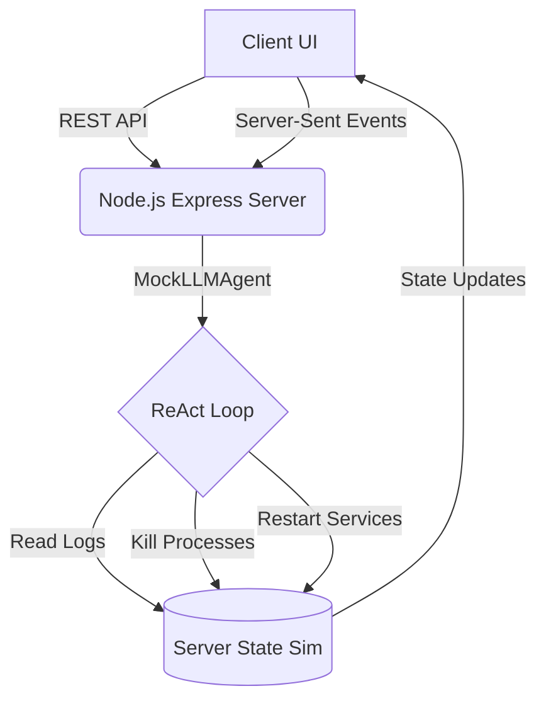

# AutoSRE DevOps Agent

An AI portfolio project demonstrating an automated Site Reliability Engineering (SRE) agent. The agent uses a ReAct (Reason + Act) loop to diagnose and resolve server incidents autonomously.

## Architecture

## The Scenario
1. The simulated server experiences an outage: Nginx returns 500 errors and CPU usage spikes to 99%.
2. When the user triggers "Auto-Resolve", the `MockLLMAgent` connects to the server and begins reasoning about the state.
3. The Agent inspects logs, identifies a disconnected database and a rogue cryptomining process consuming the CPU.
4. It takes targeted action: killing the malicious process and restarting the Postgres service.
5. The UI dynamically updates via SSE (Server-Sent Events) as the agent performs actions, bringing the server back to a healthy state.

## Stack
- **Backend**: Node.js + Express
- **Frontend**: Vanilla JS + CSS (Matrix-style Cyberpunk Terminal)
- **AI**: Simulated LLM ReAct Loop with human-readable streaming

## Quick Start
1. Ensure you have Node.js installed.
2. Run `npm install`
3. Run `npm start`
4. Open `http://localhost:3000` in your browser.

## The "Why"
This project demonstrates understanding of:
- **LLM Agent Paradigms**: Implementing Reason + Act loops and exposing tools to an AI.
- **Event-Driven Architecture**: Streaming real-time updates to a frontend UI using Server-Sent Events.
- **SRE Principles**: Simulating real-world devops scenarios (investigating logs, mitigating load, restarting dependent services).
- **UX/UI**: Designing an engaging, premium "hacker" aesthetic that visually communicates complex agent reasoning in an accessible way.
